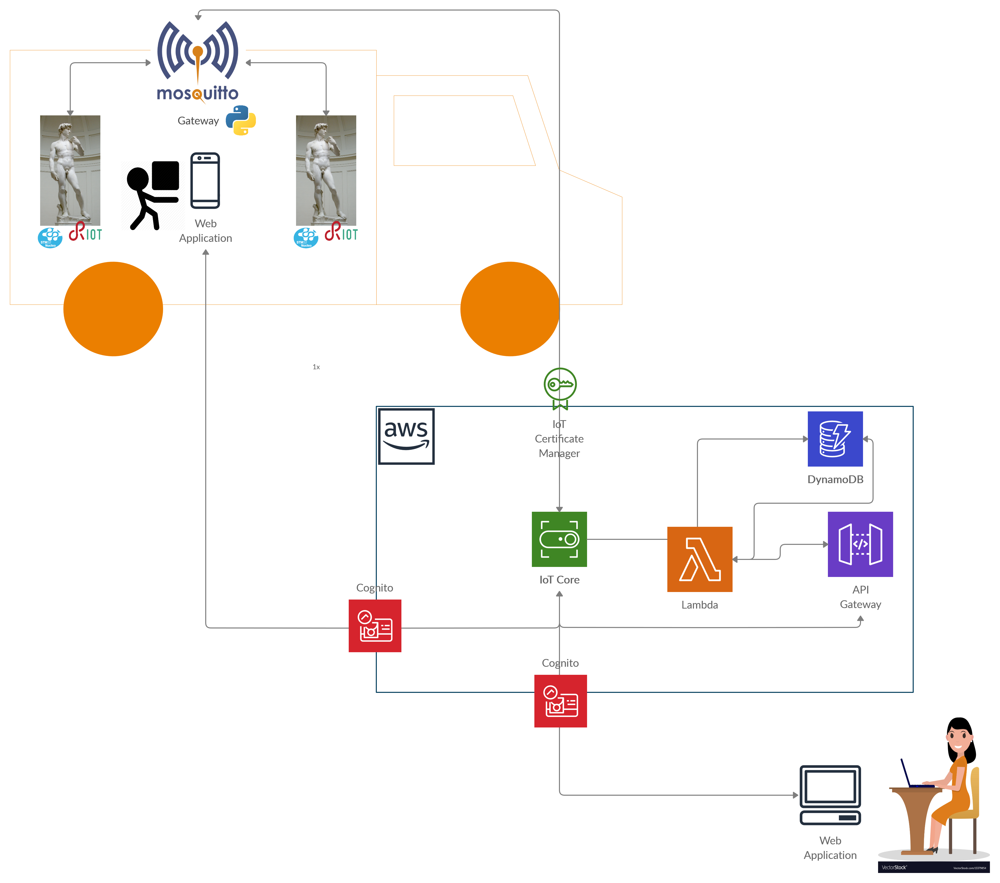

# PlasterSafe Architecture
This section contains references on the architecture used for this project, along with details on how the various technologies interact between each other.
## Overview
The main components of *PlasterSafe* can be seen on the image below:

As we can see:
* The cloud infrastructure is build on [AWS](https://aws.amazon.com/it/console/), in particular we used the following services provided by the platform:
  * IoT Core: service that gives us the opportunity to create a broker for each statue,
  * DynamoDb: NoSql database that gives us the opportunity to store data from the statues and the overall application,
  * API Gateway: container that will host Web-APi services for the *mobile appplication*/*web client*. 
  * Lambda: platform service that will Also, it will receive data from the *IoTCore MQTT broker*.
  * Cognito: used to give permissions to users to use the system 
* The statues need to be connected to a local *MQTT-SN broker*, which comes with a gateway that sends data to AWS through an MQTT connection.
* Each statue has board on the support surface. We took as a reference an [STM 32 Nucleo Board](https://www.st.com/en/evaluation-tools/stm32-nucleo-boards.html), but any board that has the following characteristics can be used:
  * run an instance of [RIOT-OS](https://github.com/RIOT-OS/RIOT),
  * *MQTT-SN* technology support,
  * gyroscope, accelerometer and temperature sensors.

We have implemented three ways of operating the gateway:
* The STM32 is connected via the serial port with the Gateway;
    * Mode that comes closest to reality, we connected the board via the serial because we are not in possession of the antennas. 
 * The STM32 board is emulated locally and then connects via the Mqtt-SN protocol with the Gateway;
    * Mode used to test the system with the Mqtt-sn protocol.
 * Every behavior of the statues is emulated by a Python script and then sent to the Cloud;
    * Mode implemented to carry out cloud connection tests, all data are generated randomly.
In all three versions, the Gateway works the same way, received the data, processes it and then sends it to the cloud.

For the user, we have developed a Web App so that it can be run on any device equipped with a browser. The application features are simple and intuitive:
* View the data of each statue in real time;

* Change the tolerance thresholds for each control parameter;

* View and download a timeline of the statues.