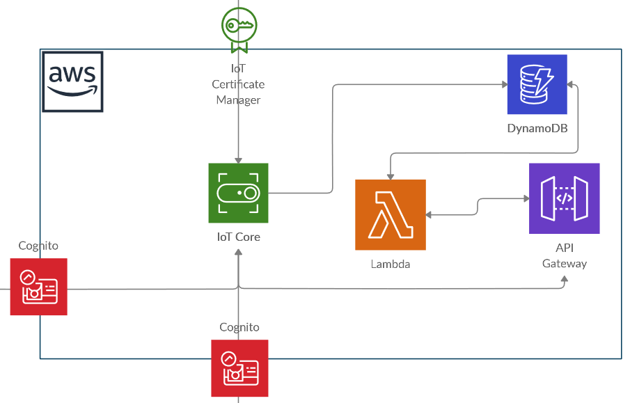
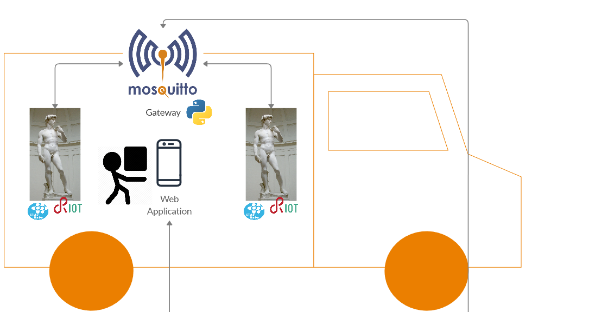
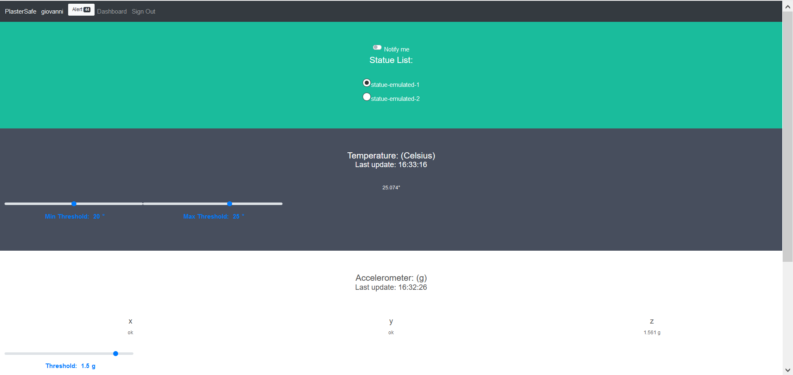
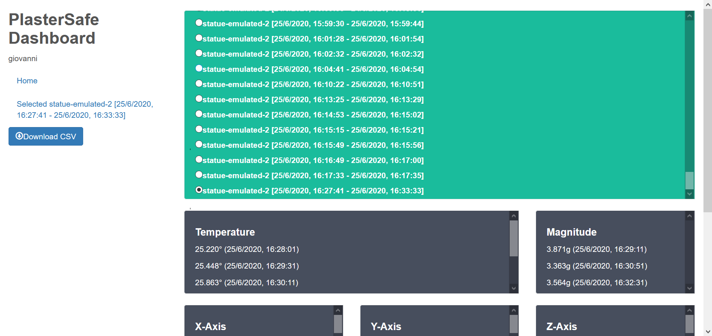

# PlasterSafe Architecture
This section contains references on the architecture used for this project, along with details on how the various technologies interact between each other.
## Overview
The main components of *PlasterSafe* can be seen on the image below:

### Cloud Infrastructure

The cloud infrastructure is build on [AWS](https://aws.amazon.com/it/console/), in particular we used the following services provided by the platform:
  * *IoT Core*: service that gives us the opportunity to create a broker for each statue,
  * *DynamoDb*: NoSql database that gives us the opportunity to store data from the statues and the overall application,
  * *API Gateway*: container that will host Web-APi services for the *mobile appplication*/*web client*. 
  * *Lambda*: platform service that will Also, it will receive data from the *IoTCore MQTT broker*.
  * *Cognito*: used to give permissions to users to use the system 
### The Board
The statues need to be connected to a local *MQTT-SN Broker*, which comes with a gateway that sends data to AWS through an MQTT connection. If only one board is deployed in the solution, it can also be connected to the gateway through a serial interface to speed-up the communication. Each statue has board on the support surface. We took as a reference an [STM 32 Nucleo Board](https://www.st.com/en/evaluation-tools/stm32-nucleo-boards.html), but any board that has the following characteristics can be used:
  * run an instance of [RIOT-OS](https://github.com/RIOT-OS/RIOT),
  * *MQTT-SN* technology support,
  * accelerometer and temperature sensors. In our case, we used an [LSM303DHLC digital sensor](https://www.st.com/en/mems-and-sensors/lsm303dlhc.html) that has both linear accelerometer and termometer.

### The gateway
We have implemented three ways of operating the gateway:
* *serial*: the STM32 is connected through a serial port with the Gateway;
    * Mode that comes closest to reality, we connected the board via the serial because we are not in possession of the antennas. 
* *mqttsn*: the gateway receives data from the statues using the MQTSSN-Protocol:
    * Mode used to test the system with the MQTT-SN Protocol,
    * Needs a Mosquitto-RSMB broker running locally.
* *emulated*: every behavior of the statues is emulated by a Python script and then sent to the Cloud;
    * Mode implemented to carry out cloud connection tests, all data are generated randomly.
    
Given this three modes, the *Gateway* always follows the same approach when the data from a statue (emulated or not) has been received: if one of the measures detected by the  statue is beyond a given threshold, it will be sent to the cloud. Also a set of samples is stored for each statue to compute the *Signal Magnitude Area* of the accelerations. Another thread in the background will check whether the statue are communicating properly with the gateway: if some statue stops communicating, an alert message will be sent to the cloud. So all the computation is done by the gateway, leaving the cloud the only duty to store the data to *DynamoDb*.
### Web Application
For the final users, we have developed an [*HTML5 Web App* available on GitHubPages](https://flowerofthebridges.github.io/PlasterSafe/plastersafe_webapp/) so that it can be run on any device equipped with a browser. After being authenticated throught the *Cognito Service*, the application will read the data from the topics given by the *IoT Core* platform through a *WebSocket Connection*. It also uses the *Notification API* to inform whether something happens within the system. The application features are simple and intuitive:

* view the status of each statue in real time;

* change for each statue the tolerance thresholds for the given measures;

* view and download in *CSV Format* a timeline of the statues.

